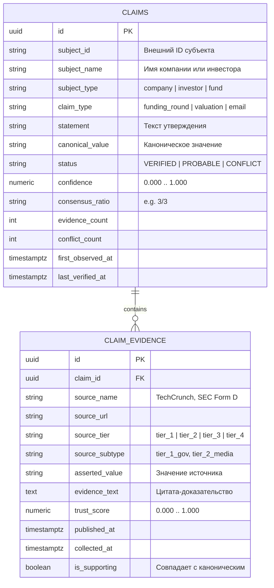

# Архитектурная спецификация системы утверждений и доказательств (DAY 4 — CLAIM + EVIDENCE SYSTEM)

> **Статус документа:** Production Architecture Specification  
> **Версия движка:** `Claim + Evidence Engine v1.0` (`data_pipeline/claim_evidence_engine.py`)  
> **Схема БД:** `db/claims_evidence_schema.sql` (PostgreSQL / Supabase)  
> **Интеграция:** `data_pipeline/source_trust_engine.py` (Day 3), `data_pipeline/data_provenance_engine.py` (Stage 7)  
> **Принцип надежности:** Эпистемическая 7-звенная цепочка происхождения фактов (7-Layer Epistemic Provenance Chain)

---

## 1. Введение: Крах плоской модели данных

В традиционных венчурных базах данных (Crunchbase, PitchBook, Dealroom) факты хранятся в виде примитивных плоских троек сущность–атрибут–значение:
$$\text{Company X} \longrightarrow \text{Funding} \longrightarrow \$5\text{M}$$
$$\text{Investor Y} \longrightarrow \text{Email} \longrightarrow \text{investor@fund.com}$$

### Почему эта архитектура непригодна для разведывательных систем высокой точности:
1. **Утрата происхождения (Loss of Provenance):** Теряется ответ на фундаментальные вопросы: *Кто это заявил? Из какого документа взят факт? Когда это было опубликовано?*
2. **Деструктивная перезапись (Destructive Overwrites):** Если парсер находит в пресс-релизе `$5M`, а через месяц другой каталог пишет `$4.5M`, плоская база либо вслепую затирает старое значение, либо отбрасывает новое. Противоречие и альтернативная точка зрения безвозвратно уничтожаются.
3. **Иллюзия абсолютной достоверности:** Любая цифра на экране выглядит одинаково истинной — будь то выписка из SEC Form D или анонимный слух из Reddit.
4. **Невозможность разрешения коллизий (No Conflict Representation):** В реальном венчурном мире оценки и раунды часто оспариваются (например, пре-мани против пост-мани, транши с отсрочкой, долг против эквити). Плоская база не может выразить состояние **`CONFLICT`**.

---

## 2. 7-Звенная эпистемическая цепочка OpenAngels

В рамках этапа **DAY 4** архитектура OpenAngels переведена на модель первого класса **Claim + Evidence**:

```
      CLAIM (Семантическое утверждение с субъектом и предикатом)
        ↓
      VALUE (Каноническое согласованное значение факта)
        ↓
     SOURCE (Реестр атрибутированных источников с рангами Tier 1–4)
        ↓
    EVIDENCE (Дословные цитаты, выписки из документов, SMTP-логи)
        ↓
      DATE (Временная линия: published_at, collected_at, verified_at)
        ↓
   CONFIDENCE (Контекстный статистический балл уверенности: 0.00 – 1.00)
        ↓
     STATUS (Эпистемический статус: VERIFIED | PROBABLE | CONFLICT)
```

### Статусы утверждений:
- **`VERIFIED` (Подтверждено):** Несколько независимых источников высокого доверия (Tier 1–2) сходятся во мнении. Консенсус $\ge 75\%$, уверенность $\ge 0.90$, конфликты отсутствуют.
- **`PROBABLE` (Вероятно):** Утверждение подтверждено одиночным авторитетным источником либо доминирует по весу над второстепенными упоминаниями.
- **`CONFLICT` (Обнаружен конфликт):** Два и более авторитетных источника заявляют существенно разные значения (например, `$6.5B` vs `$6.0B`). **Система не удаляет ни одно значение**, а сохраняет оба кластера доказательств и выставляет статус `CONFLICT` для прозрачности перед пользователем.
- **`DISPUTED` (Оспорено):** Утверждение прямо опровергнуто субъектом или регуляторным органом.
- **`UNVERIFIED` (Не верифицировано):** Единственные источники — нерепутационные соцсети или парсеры Tier 4.

---

## 3. Практические кейсы: VERIFIED vs CONFLICT

### Кейс 1: Полный консенсус трех источников (`VERIFIED`)
**Утверждение:** «Company X raised $5M in Series A»

```text
CLAIM:      "Company X raised $5M in Series A"
  ↓
VALUE:      $5M
  ↓
SOURCE:     Company website (TIER_1), Investor website (TIER_1), TechCrunch (TIER_2)
  ↓
EVIDENCE:   "Company X announces $5,000,000 Series A funding led by OpenAngels to scale AI agents."
  ↓
DATE:       2024-02-10 (Collected: 2026-09-11)
  ↓
CONFIDENCE: 95.0% (Consensus: 3/3)
  ↓
STATUS:     [VERIFIED]
```

### Кейс 2: Противоречие в сумме финансирования (`CONFLICT`)
**Утверждение:** «Stripe raised Series I round»  
- *Источник A (Wall Street Journal, Tier 2):* заявляет `$6.5B` («Stripe finalizes terms to raise $6.5 billion...»)
- *Источник B (FinTech Insider, Tier 3):* заявляет `$6.0B` («Payments giant Stripe closes financing round at $6.0 billion...»)

```text
CLAIM:      "Stripe raised Series I round"
  ↓
VALUE:      $6.5B
  ↓
SOURCE:     Wall Street Journal (TIER_2), FinTech Insider (TIER_3)
  ↓
EVIDENCE:   "Stripe finalizes terms to raise $6.5 billion at a $50 billion valuation."
  ↓
DATE:       2023-03-16 (Collected: 2026-09-11)
  ↓
CONFIDENCE: 70.0% (Consensus: 1/2)
  ↓
STATUS:     [CONFLICT]
  [!] CONFLICT DETAILS:
      - FinTech Insider: claimed '$6.0B' (vs '$6.5B')
```

> **Архитектурное преимущество:** Вместо того чтобы наугад стереть `$6.0B` или `$6.5B`, OpenAngels сохраняет обе цитаты, вычисляет дельту расхождения и предупреждает пользователя об активном финансовом разночтении.

---

## 4. Схема реляционной базы данных (`db/claims_evidence_schema.sql`)

### Диаграмма сущностей (ERD)



### Аналитическое представление: `conflicting_claims_view`
В схеме создан специальный SQL-view для оперативного мониторинга спорных данных:
```sql
CREATE OR REPLACE VIEW conflicting_claims_view AS
SELECT 
  c.id AS claim_id,
  c.subject_name,
  c.claim_type,
  c.canonical_value,
  c.status,
  c.confidence,
  c.consensus_ratio,
  ce.source_name AS dissenting_source,
  ce.asserted_value AS dissenting_value,
  ce.evidence_text AS dissenting_evidence,
  ce.trust_score AS dissenting_trust
FROM claims c
JOIN claim_evidence ce ON c.id = ce.claim_id
WHERE c.status = 'CONFLICT' AND ce.is_supporting = false;
```

---

## 5. Программный интерфейс (Python API)

Модуль [`data_pipeline/claim_evidence_engine.py`](file:///d:/Users/00001/openangels/data_pipeline/claim_evidence_engine.py) предоставляет законченный набор классов и методов:

```python
from data_pipeline.claim_evidence_engine import ClaimEvidenceEngine

engine = ClaimEvidenceEngine()

# 1. Запись доказательства к утверждению
claim = engine.record_claim_assertion(
    subject_id="comp_openai",
    subject_name="OpenAI",
    claim_type="funding_round",
    statement="OpenAI raised $6.6B in 2024 funding round",
    asserted_value="$6.6B",
    source_name="TechCrunch",
    source_url="https://techcrunch.com/2024/10/02/openai-raises-6-6b",
    evidence_text="OpenAI has closed a new $6.6 billion funding round valuing the company at $157 billion.",
    published_at="2024-10-02T16:00:00Z",
    source_tier="tier_2"
)

# 2. Бесшовная конвертация из плоской структуры (Lossless Triple Upgrade)
flat_claim = engine.from_flat_triple(
    subject_name="Anthropic",
    predicate="funding_round",
    object_value="$4B",
    source_name="Amazon SEC 10-Q Filing",
    source_url="https://sec.gov/edgar/data/amazon-10q",
    evidence_text="Amazon closed an aggregate $4.0 billion convertible investment in Anthropic PBC.",
    published_at="2024-03-27T16:00:00Z"
)

# 3. Человекочитаемый 7-звенный вывод
print(flat_claim.format_epistemic_chain())
```

---

## 6. Гарантия неразрушаемости системы (Non-Breaking Architecture)

- **Сохранность существующих таблиц:** База данных `investors` и существующая таблица `investor_evidence` не затрагиваются и продолжают обслуживать текущий интерфейс каталога.
- **Стабильность CLI:** Файл запуска `run_master.bat` и все 4 режима (Deep Harvest, Target Contacts 200, RSS Monitor, Live DQS Audit) работают без изменений.
- **Полная обратная совместимость:** Модуль `data_provenance_engine.py` обогащен методом `to_epistemic_chain()` и продолжает проходить все тесты спецификации Stage 7 на 100%.
