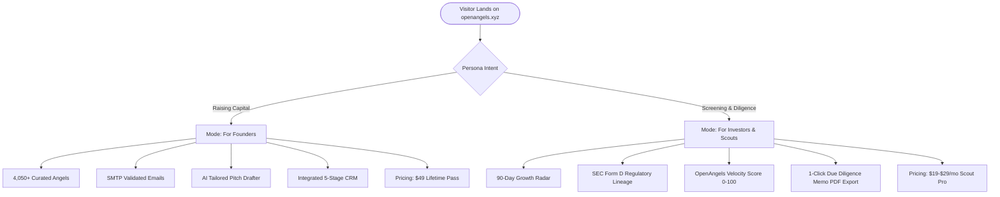

# OpenAngels — Ideal Customer Profile (ICP) & Persona Architecture

> **Executive Summary:**  
> OpenAngels serves two distinct, high-intent market segments with zero artificial overlap:
> 1. **Early-Stage Founders (Capital Seekers)** — Need verified direct contact channels to active angels without paying $400+/mo for legacy enterprise databases.
> 2. **Venture Scouts & Emerging Syndicate Leads (Deal Schedulers & Due Diligence Analysts)** — Need real-time temporal velocity signals, SEC Form D lineage, and one-click IC Due Diligence memos without a $25,000/yr PitchBook contract.

---

## Segment 1: The Early-Stage Founder (Capital Seeker)

| Attribute | Details |
| :--- | :--- |
| **Role / Title** | Technical Founder, First-Time Founder, Pre-Seed / Seed CEO |
| **Startup Stage** | Idea to Post-MVP / First $10k-$50k MRR |
| **Capital Goal** | Raising $150k – $1.5M Pre-Seed / Seed round |
| **Geography** | Global (Silicon Valley, New York, London, Berlin, Singapore, Bangalore, Remote) |
| **Primary Frustration** | Lack of warm venture introductions; gatekeeping by Tier 1 VCs; predatory paid directories that sell stale @info emails. |
| **Existing Alternatives** | Crunchbase Pro ($49/mo with limited contacts), PitchBook ($25k/yr enterprise only), scraping LinkedIn manually, Twitter lists. |
| **OpenAngels Solution** | Direct search across **4,050+ verified angel investors** with SMTP/DNS validated personal emails, AI Pitch Drafter matching specific thesis hooks, and an integrated 5-stage CRM. |
| **Monetization Fit** | **Founder Lifetime Pass ($49 one-time)**. Founders hate recurring SaaS drain when pre-revenue. A one-time fee provides psychological safety and permanent access. |

---

## Segment 2: The Venture Scout, Angel Syndicate Lead & VC Associate

| Attribute | Details |
| :--- | :--- |
| **Role / Title** | Scout at Tier 1/2 VC fund, Solo GP, AngelList Syndicate Lead, Venture Associate |
| **Fund Size / Activity** | $5M – $50M Micro-fund, or syndicating $50k-$250k SPVs per deal |
| **Primary Frustration** | PitchBook is cost-prohibitive for scouts and solo GPs; news feeds (TechCrunch) are 2 weeks late; manually sifting through SEC EDGAR Form D filings is painful and time-consuming. |
| **Existing Alternatives** | PitchBook/Preqin (expensive enterprise seats), Dealroom, Twitter/X scrapers, manual Google Alerts. |
| **OpenAngels Solution** | **Venture Intelligence & Growth Signals Radar**: Automated 90-day temporal traction tracking, SEC Form D claim lineage with cryptographic/regulatory confidence scores, and **One-Click Institutional Due Diligence Memo PDF Export**. |
| **Monetization Fit** | **Investor / Scout Pro ($19 – $29/mo or $199/yr)**. Justified directly as an investment research tool expense or syndicate diligence software write-off. |

---

## Feature Mapping by Persona

---

## Retention & Stickiness Strategy

1. **Founders:** Return weekly during active rounds to log investor responses in the CRM and draft contextual follow-ups using updated thesis data.
2. **Scouts & Investors:** Return weekly to review the Growth Signals Radar for valuation step-ups, headcount acceleration, and syndicate co-investment movements.
